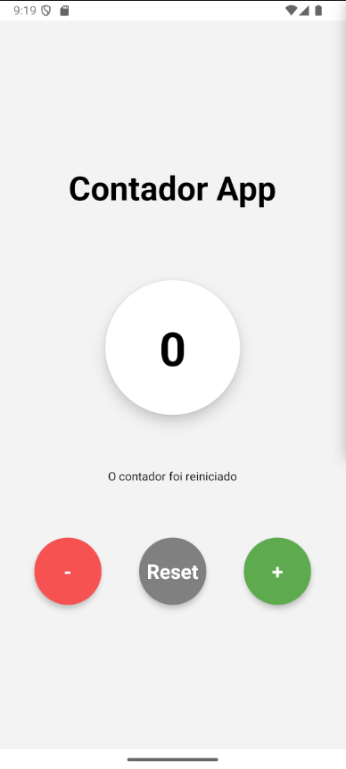

# Contador Simples - React Native 📱


Um aplicativo simples de contador com interface intuitiva e feedback visual. Desenvolvido com React Native e Expo.



## Funcionalidades ✨

- Incrementar contador (+1)
- Decrementar contador (-1)
- Resetar para zero
- Feedback visual ao resetar
- Design moderno com elevação e sombras
- Interface responsiva

## Tecnologias 🛠️

- React Native
- Expo
- JavaScript
- StyleSheet

## Como Executar 🚀

### Pré-requisitos

- Node.js (v16 ou superior)
- npm ou yarn
- Expo CLI instalado globalmente (`npm install -g expo-cli`)

### Instalação

1. Clone o repositório:

```bash
git clone https://github.com/TallysCesarGB/counterMay14
```
